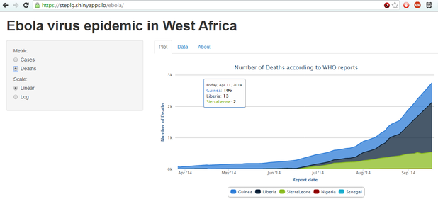
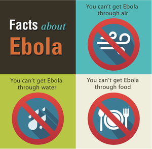

```{r echo=FALSE, hide=TRUE}
require(plyr)
```

```{r echo=FALSE, hide=TRUE}
ebola <- read.csv('../../country_timeseries.csv', stringsAsFactors=F)
ebola <- ebola[!is.na(ebola$Cases_Guinea) & !is.na(ebola$Cases_Liberia), ]
ebola$Date <- as.Date(ebola$Date, format="%m/%d/%Y")
ebola <- arrange(ebola, Date)
ebola$Cases_Total <- rowSums(ebola[, grep('Cases', names(ebola))], na.rm=T)
ebola$Deaths_Total <- rowSums(ebola[, grep('Deaths', names(ebola))], na.rm=T)
```

## What is Ebola and what's happening in Africa right now?
Ebola virus disease (EVD), or simply Ebola is a disease of humans and other primates caused by an ebolavirus. No specific treatment for the disease is yet available. The disease has a high risk of death, killing between 50% and 90% of those infected with the virus. ([wiki: Ebola virus disease](https://en.wikipedia.org/wiki/Ebola_virus_disease))

As of 2014, an epidemic of the Ebola virus disease (EVD) is ongoing in West Africa. The outbreak began in Guinea in December 2013. It then spread to Liberia, Sierra Leone, Nigeria and Senegal. ([wiki: Ebola virus epidemic in West Africa](https://en.wikipedia.org/wiki/Ebola_virus_epidemic_in_West_Africa))

---

## Total number of cases and deaths on timeline
```{r setup, message = F, echo = F, cache = F}
require(rCharts)
knitr::opts_chunk$set(comment = NA, results = 'asis', tidy = F, message = T)
```

```{r chart1, echo=FALSE}
h1 <- Highcharts$new() 
h1$chart(type='line', animation=F, width=850, height=450)
# h1$title(text=sprintf("Number of Cases and Dea according to WHO reports", input$metric))
for (name in c('Cases', 'Deaths'))
{
  yname <- sprintf('%s_Total', name)
  ebola_sub <- ebola[!is.na(ebola[, c(yname)]), ]
  # x <- format(ebola_sub$Date, "#!Date.Parse('%b, %d %Y')!#")
  x <- format(ebola_sub$Date, "#!Date.UTC(%Y, %m - 1, %d)!#")
  x <- gsub(' 0', ' ', x)
  val <- ebola_sub[, c(yname)]
  y <- sprintf("#!%s!#", val)
  p <- unname(as.list(as.data.frame(rbind(x, y))))
  
  h1$series(data=p, name=name)
}
h1$xAxis(title=list(text="Report date"), type='datetime')
h1$tooltip(shared=T, crosshairs=T)
h1$plotOptions(area=list(marker=list(enabled=F), stacking='normal'), series=list(animation=F))
h1$print('chart1')
```

---

## Monitor current status per country
You can monitor outbreak status per country and with more details here in App: https://steplg.shinyapps.io/ebola



---

## Stay informed and don't panic
Ebola virus is spread mostly with animals and blood/body fluids. (read more on [CDC about transmission](http://www.cdc.gov/vhf/ebola/transmission/index.html))

You can find infographis on various topics about this outbreak here: [CDC infographics](http://www.cdc.gov/vhf/ebola/outbreaks/guinea/print-resources-illustrations.html)


